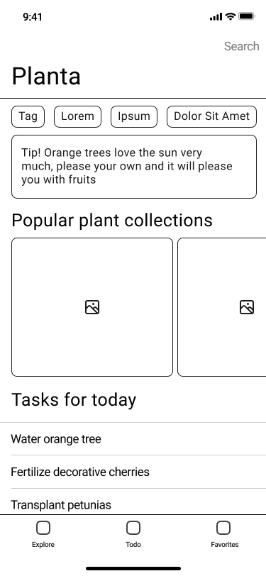
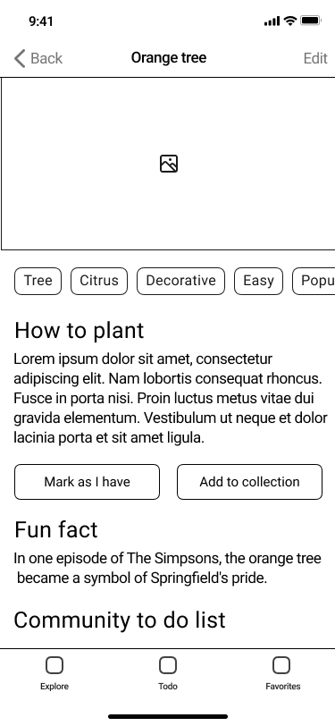
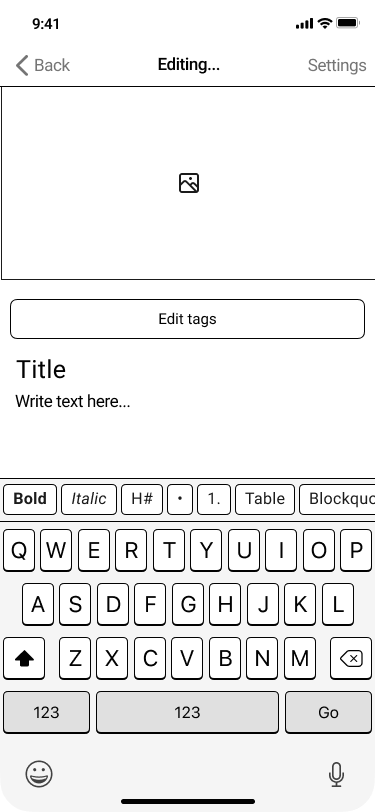
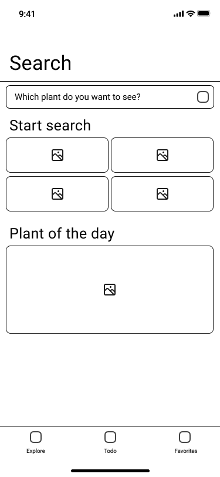
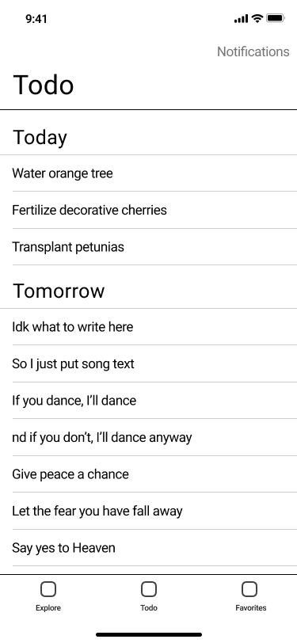

## **Отчет**

## Редактор справочника по уходу за комнатными растениями

## Автор: Шипилов Дементий, ИП-215

---

## Матрица прямого манипулирования

| Объект | Тип | Действия с объектами | Представление |
| --- | --- | --- | --- |
| Растение | Карточка | Редактирование, добавление | Название, текст, изображения |
| Категории растений | Каталог | Хранение, сортировка | Папки, подборки |
| Атрибуты ухода | Инструкция | Добавление, изменение | Чек-лист |
| Фильтрация и поиск | Взаимодействие | Поиск, фильтрация, выделение | Поле ввода, теги, фильтры |
| Рекомендации по уходу | Совет | Просмотр, сохранение | Персонализированные уведомления |

### Метафоры

- **Записная книжка** - простой редактор заметок в карточках растений для пометки дополнительной информации

- **Дневник ухода садовника** - интерактивные напоминания, подобные советам от садовников, по уходу за домашними растениями

- **Домашний андроид-садовник** - интеграция приложения с устройствами умного дома для автоматизации полива и ухода за растениями

- **Волшебная палочка** - *AR*-модели растений, которые можно "поставить" в интерьере и посмотреть, как будут сомтреться новые цветы

- **Карманный справочник** - приложение сохраняет информацию о необходимых растениях в выбранном регионе и всегда доступно из любого места без привязки к мобильной сети

- **Садовый фильтр** - список тегов, позволяющий фильтровать и искать новые или нужные растения под определенные требования

## Модель действий пользователя

- Роли пользователей

    - **Пользователь** - ищет информацию об уходе за растениями, дополниет ее, сохранияет важную информацию, а также делится с людьми вокруг
    - **Автор** - создает и редактирует краткие выжимки по растениям, создает списки задач для интерактивных напоминаний и просматривает статистику по популярным растениям

- Список действий

    - Поиск растений
    - Редактирование и дополнение информации о растениях
    - Отметка пунктов в чек-листе
    - Взаимодействие с уведомлениями и виджетами
    - Чтение важной информации
    - Получение рекомендаций по уходу

- Модель действий

    ``` mermaid
    flowchart LR
        A(Открытие приложения) --> B(Поиск растения) --> C(Открытие результата поиска) --> D(Добавление в избранное) --> E(Чтение и редактирование статьи) --> F(Отметка пунктов в чек-листе)
    ```

## Структурная модель

- Используемые элементы интерфейса

    - **Вкладки** - панель выбора необходимой вкладки
    - **Чекбоксы** - кнопка отметки выполнения задачи из списка
    - **Карточки** - блоки информации с полезной информацией
    - **Галерея и изображения** - профессиональные фотографиии растений
    - **Текст** - основное содержание кратких статей
    - **Поисковая строка** - поиск и сортировка растений по тегам, таким как тип, вид, цвет, размер и т.д.
    - **Виджеты** - виджеты с изображениями растений или советами и напоминаниями на главном экране
    - **Фильтры и теги** - блоки с информацией о растении, открывающие сортировку по похожим растениям

- Схемы экранных кадров

    - **Все экраны**

        - **Нижняя панель** - панель вкладок с переходом в "Исследование", содержащее рекоммендуемую подборку пользователю, "Список задач" и "Избранное"
        - **Верхняя панель** - название приложения и открытой подборки или растения
        - **Рабочая область** - статьи и чек-листы по растениям, советы по имеющимся растениям, подборки или быстрый редактор заметок

    - **Главный экран** - персонализированные советы на основе имеющихся и недавно просмотренных растений, а также интересные факты

    - **Статья** - вики-подобная краткая выжимка информации о растении с рекомендуемым чек-листом или чек-листом пользователя, заметками, интересными фактами и фотографиями

    - **Экран редактирования** - простой редактор текста на основе синтаксиса Markdown и кнопками выбора оформления

- Графическое представление

    ```mermaid
    flowchart TD
        S(Поиск) --> |Результат| B
        A(Главный экран) -->|Подборки| B(Вики)
        A --> C(Список задач) --> B
        B --> E(Редактор)
    ```

## Последовательно-динамическая модель 

- Роли пользователей

    - **Исследователь** - пользователь, не имеющий ни одного цветка дома, но жеающий просто быстро узнать интересующую информацию о растении и сразу же после удалить приложение
    - **Ученый** - пользователь, обожающий ботанику и регулярно изучающий все энциклопедии и статьи, что попадаются ему на пути
    - **Нуждающийся** - пользователь, который задумался о приобретении растения, но не способный выбрать, что стоит взять
    - **Садовод** - пользователь, регулярно использующий вспомогательные функции приложения для ухода за своими растениями
    - **Редактор** - автор текста, регулярно пополняющий базу данных растений и дорабатывающий статьи и чек-листы

- Объекты интерфейса

    - Поле поиска и выбора тегов, подобные тем, что есть в сервисах для чтения манги
    - Страница растения, похожая на вики-страницам
    - Кнопки редактирования, дополнения и сохранения растений
    - Чек-листы с повторяющимися напоминаниями о необходимых действиях, подобные кулинарным рецептам с графическими изображениями действий
    - Блоки с подсказками, советами и интересными фактами о цветах

| Шаг | Роль | Действие пользователя | Объект интерфейса | Реакция системы | Результат |
| --- | --- | --- | --- | --- | --- |
| 1 | Поисковая | Ввод запроса в строку поиска | Поле поиска | Система фильтрует растения и подборки | Список отфильтрованных растений |
| 2 | Исследовательская | Выбор интересующего растения | Карточка растения | Открывается информация о растении | Отображение вики-страницы растения |
| 3 | Садоводческая | Просмотр информации по уходу за растением | Блок рекомендаций | Система отображает советы по уходу | Персонализированные рекомендации |
| 4 | Подстраивающая | Просмотр уведомления | Уведомление | Система отображает уведомление | Напоминание о действии по уходу |
| 5 | Авторская | Редактирование/дополнение статьи | Кнопка редактирования | Открывается окно редактора | Внесение изменений в статью |
| 6 | Исследователь | Добавление растения в избранное | Кнопка добавления в избранное | Система сохраняет растение в списке | Растение добавлено в избранное |
| 7 | Авторская | Просмотр статистики просмотров | Статистика по статьям | Система показывает количество просмотров	| Автор видит аналитику по растениям |

</br>

## Прототипы интерфейса



*Изображение 1. Главный экран приложения*



*Изображение 2. Статья*



*Изображение 3. Редактор текста*



*Изображение 4. Редактор текста*



*Изображение 5. Редактор текста*
